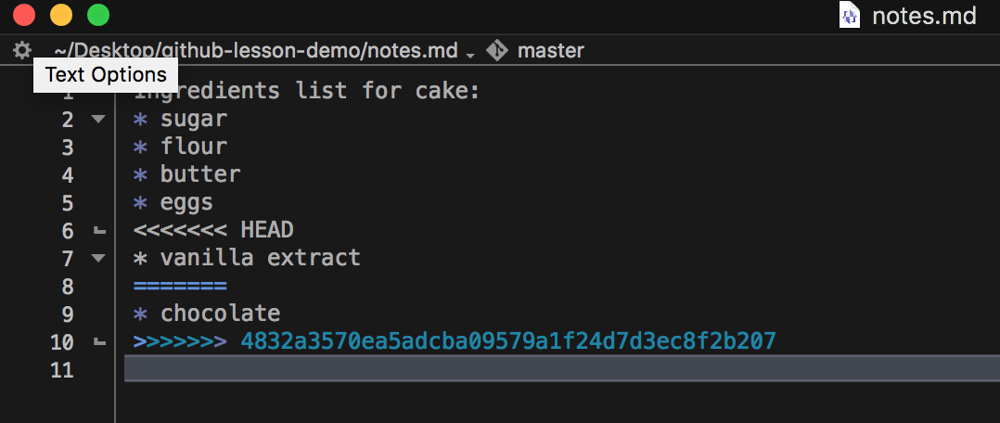

```{r setup, include=FALSE}
options(htmltools.dir.version = FALSE)
```

```{r xaringan-themer, include=FALSE, warning=FALSE}
library(xaringanthemer)
style_solarized_light(
  base_font_size = "32px", 
  header_h1_font_size = "2.0rem",
  header_h2_font_size = "1.5rem",
  header_h3_font_size = "1.25rem", 
  header_background_content_padding_top = "2rem", 
  header_font_google = google_font("Lato"),
  text_font_google   = google_font("Montserrat", "300", "300i", "500"),
  code_font_google   = google_font("Source Code Pro", "300", "500"), 
  extra_css = list("p" = list("margin-block-start" = "0.5em", 
                              "margin-block-end" = "0.5em"), 
                   "ul" = list("margin-block-start" = "0.5em", 
                              "margin-block-end" = "0.5em"), 
                   "li" = list("margin-block-start" = "0.5em", 
                              "margin-block-end" = "0.5em"), 
                   "pre" = list("margin-top" = "0.5em", 
                              "margin-bottom" = "0.5em"), 
                   ".small" = list("font-size" = "80%"), 
                   ".tiny" = list("font-size" = "50%")),  
  link_color = "#339944"
)
```
class: inverse, center, middle

# `r desc::desc_get('Title', '..')`
### `r rmarkdown::metadata$author`
### `r rmarkdown::metadata$institute`
### (updated: `r Sys.Date()`)

---
You have a published data analysis.

--

### .center[🎉 Congrats! 🎉]

--

What happens next?

--

* Can **I** apply the code to **new** data?
* Can **I** apply **my method** to your data?
* **Where** do you store older versions / figures that didn't make it into the paper?
* How does someone contribute to the project?

---
# Preliminaries

This lesson assumes you:
`r gsub("\n ", "\n", desc::desc_get("prerequisites"))`

--

**NO** previous experience with git is required, but familiarity with using Git and GitHub will be very helpful!

---
# Learning Objectives

This lesson teaches you to:

`r gsub("\n ", "\n", desc::desc_get("learningOutcomes"))`

---

class: inverse, center, middle

# Basic Concepts

---
# Version Control

**Version Control** – tools/systems to manage changes to files

--
## You are probably already using version control!

* MS Word has "track changes"
* Dropbox / Google Drive can revert versions

---
# Why Learn Git & GitHub

Git & GitHub are version control tools for **projects**.

You can:
* restore project states involving changes to multiple files.
* track *who* made *what* changes and *why*
* handle changes in any file format
* manage work from large distributed teams

---
# Example scenarios

* You change a histogram to a bar plot, and then you want to change it back.
* Your collaborator makes edits while traveling, and you need to combine their changes with changes you made in the meantime.
* You want to experiment with a different dataset / analysis / narrative without duplicating everything.

---
# Getting Started with Git

* Git versioning occurs on the level of a projects:
  - A project folder is a **repository** or **repo**, for short.
  
* To start version control for a project folder, use the shell to navigate into the folder and run the command `git init`

* This creates the `.git` folder to track the contents of the folder and subfolders.

---
class: center, middle

# DEMO

---
# Making Commits

* Changes are recorded by taking a snapshot of the folder:
  - each snapshot is called a **commit**.
* Commits only track the changes from the previous commit (this saves disk space).

---
# Commit Structure

* each commit has a **commit message**
  - 1-line summary
  - blank line
  - further details
* each commit also records **who** and **when**
* good commit messages help you find the right past project state!

---

```{r, echo = FALSE, fig.cap = "A screenshot of the website https://github.com/uf-repro/friendly-github-intro/commits/main, showing the commit log for the repo of the Friendly Github Intro lesson. Each commit entry has an associated date and time, the author, and the summary of the commit message."}
knitr::include_graphics("commits_example.png")
```

---

# Constructing a Commit

* each commit is created *manually*
1. `git add` files with changes (including new files)
2. `git commit` and write the commit message
  - `git commit` by itself will open a text editor (you can set which one with `git config`)
  - `git commit -m "message"` lets you inline a short message

---
# Why so tedious?
* The commit procedure is more work than a simple button press!
* This procedure gives you control over which changes are recorded in each commit
  - if you make edits in multiple files, you can group the changes into meaningful commits
* The commit message is important to find correct versions later

---
class: center, middle

# DEMO

---

# Navigating Commits

* Git generates a unique **hash** for each commit
* You can recover a past project state by using the `git checkout` command and the desired hash
  - The file/folder contents will change to reflect the project state for that commit.
  - Return using `git checkout <branch>`

--

*In Git, files and folders are mutable; nothing is safe unless it is in a **commit**.*

---
class: center, middle

# DEMO

---
class: inverse, center, middle

# GitHub as a Backup System

---

Making a file backup = storing a copy in another location

**How do you backup a Git repository?**

--

Git stores all of the information about the commit history, etc. inside a hidden folder called `.git` within the project folder.

* You can copy over the project folder, and it will contain the full git history. (e.g. You can store it in Dropbox.)

* You can also specify other locations to synchronize a git repository to.  
  These are called **remotes**.

---
# GitHub

GitHub is a cloud platform that can store remotes.

There are 2 basic ways to set up a GitHub remote:

1. Create an empty GitHub repository to be the remote location for a project. Clone this to your computer to start a new project.
2. Create an empty GitHub repository to be the remote location for a project. Add the location as a remote for an existing repository.

---
# Synchronizing Remotes

When you have commits to synchronize across remotes, there are 2 commands to use.

These commands are relative to the local repository where they are run from.

1. `git push` will send all new commits on the current branch to the default remote ("origin")
1. `git pull` will retrieve new commits from the remote.

---
class: center, middle

# DEMO

---
class: inverse, center, middle

# Branches Let You Experiment

---

For simple projects, your commits might proceed in a linear fashion:
  - each commit is an incremental step forward
    (commits track only changes from the previous commit)

But you might be working on different aspects of your project at the same time!

--

**branches** allow you to label and save work that may or may not end up in a final version to be published.

---

```{r, echo = FALSE, out.width = "80%", fig.alt = "A diagram from https://www.atlassian.com/git/tutorials/using-branches, of a git repo represented in a diagram with commits as circular nodes, with edges between them showing the relationship between commits and their parents. There is a `Master` branch in light blue, a `Little Feature` branch in purple with one commit, and a `Big Feature` branch in green with 3 commits."}
knitr::include_graphics("git-branch.svg")
```

.small[[img: https://www.atlassian.com/git/tutorials/using-branches]]

* different branches are separate paths, and in different colors
* each point on a branch is a commit

---

# Merges

A `merge` combines changes from separate branches together into a new commit.

(A merge might also combine changes from a remote with local changes.)
--

* If the changes are in separate files or separate sections of a common file, merging is automatic.

* Otherwise, a **merge conflict** occurs, and you need to manually reconcile the differences for the merge commit.

---
# Example Merge Conflict

```{r, echo = FALSE, fig.alt = "A screenshot of BBedit showing the merge conflict. Line 6 is '<<<<<<< HEAD'`' indicating the start of one version of the file. Line 8 is '=======' indicating the end of one version and the beginning of the next. Line 10 shows '>>>>>>>' followed by a hash, indicating the end of the second version."}

```

---
# Resolving Conflicts

To resolve conflicts:
1. pay attention to the file(s) that have conflicts
2. modify the conflicting files to be the version you want in the merge commit
3. add the files and create the merge commit

---
class: center, middle

# DEMO

---
class: inverse, center, middle

# Collaborating

---
# Sharing Repos

On GitHub, you can add other accounts as collaborators to give them write access.

--

### Example scenario

Two people, A and B, are working together:
* A `commits`, A `pushes` to GitHub.
* B `pulls` the changes, creates new `commits`, and `pushes` to GitHub.
* A must `pull` the changes from GitHub.

---

# The GitHub Flow System

**Github Flow** is a system for easier collaborations using a shared GitHub repo:

* a primary branch, e.g. "main", stores the current, working versions of the project
* work is carried out in branches
* when work is ready to be merged into "main", a **pull request** is created on GitHub
  - this allows discussion and review
* after merging, unneeded branches can be deleted

---
class: center, middle

# DEMO

---
class: inverse, center, middle

# Working on HiPerGator

---
# Recommended Practices

* set up SSH key for authentication
* do development elsewhere
  - only run working code on HiPerGator
  - make it easy to toggle between a test dataset and an actual dataset

---
# SSH Key Setup

An SSH key lets you authenticate to GitHub without having to use your password each time.

Create a new SSH key on HiPerGator - https://docs.github.com/en/authentication/connecting-to-github-with-ssh/generating-a-new-ssh-key-and-adding-it-to-the-ssh-agent 

Add a new SSH key to your GitHub account - https://docs.github.com/en/authentication/connecting-to-github-with-ssh/adding-a-new-ssh-key-to-your-github-account

---
# General Workflow

1. Do your development
2. Push a working version to GitHub
3. Clone to HiPerGator or Pull changes to HiPerGator
4. Run your code
5. Commit results OR download the results from HiPerGator

---
class: center, middle

# DEMO

---
# Final Tips

* It takes time and practice to get used to Git and GitHub!
* Getting started now will help you develop habits for later (when you may be part of a dedicated team or have larger projects).
* Don't be afraid to ask for help.
* Look for workflow helpers (e.g. shell auto-completion)

---
# Thanks

* Check out the [Getting Started checklist](https://ha0ye.github.io/github-practices-BME6938/checklist.html) for actions to get started.
* Check out the [Resources](https://ha0ye.github.io/github-practices-BME6938/resources.html) page for tutorials and guides
* Contact me if you have questions or would like a (free) consultation on reproducibility / sharing of your data science project.
* https://guides.uflib.ufl.edu/reproducibility has more info and my contact info
